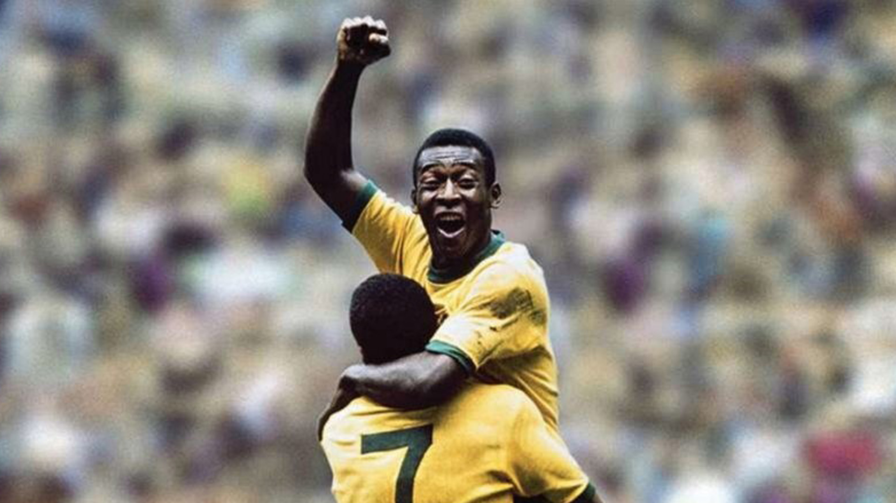

Pelé ou 
Edson Arantes do Nascimento

---

<table>
  <tr>
    <td style="width: 40%; vertical-align: top;">
      
    </td>
    <td style="padding-left: 20px; vertical-align: top;">

### Pelé, o eterno rei do futebol

#### CLÁSSICOS DO ESPORTE  
**Por Victor Hugo**

> A lenda de Pelé transcendeu o futebol e se tornou um símbolo global de genialidade, paixão e superação.  
> Em tempos de reflexão sobre o papel dos ídolos e a construção da identidade cultural, sua história ressurge como um exemplo raro de talento que uniu povos, quebrou barreiras e inspirou gerações.  
> Em campo, dançava com a bola. Fora dele, lutava com humildade e firmeza por respeito e dignidade.
  </tr>
</table>

---

**Qualquer um diria que chamar Pelé de rei é apenas uma metáfora exagerada.**  
Mas a verdade é que ele não apenas reinou — ele fundou um império.  
O império da bola, da arte em movimento, da esperança estampada no sorriso de milhões.

Pelé não foi apenas o maior jogador de futebol de todos os tempos.  
Ele foi um **homem negro que encantou o mundo com os pés e com o coração**.

> “Se eu nasci para isso, então cumpri minha missão.” — *Pelé*

---

© 2025 Victor Hugo - Todos os direitos reservados

